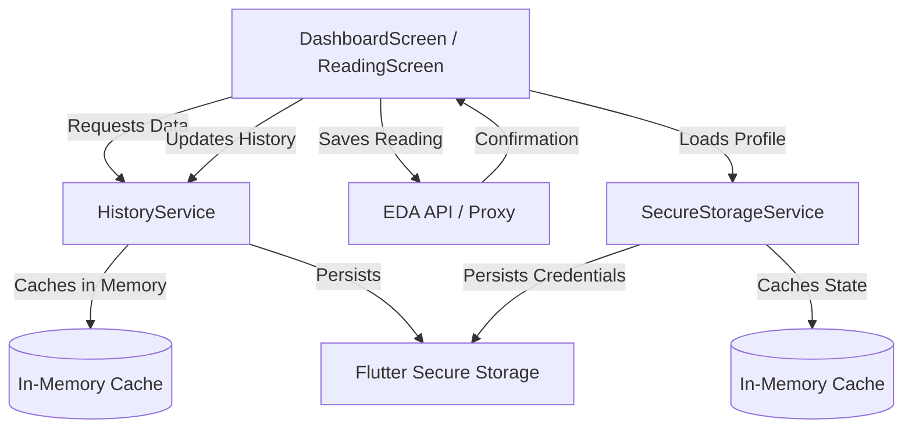
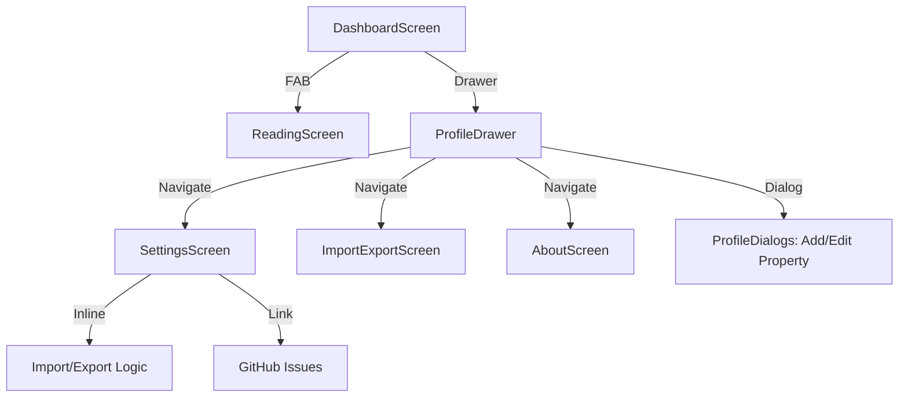
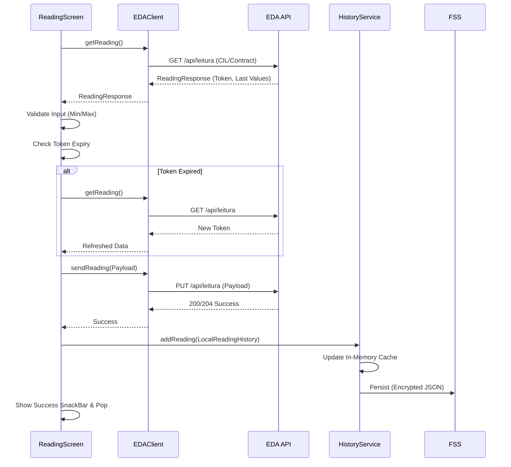
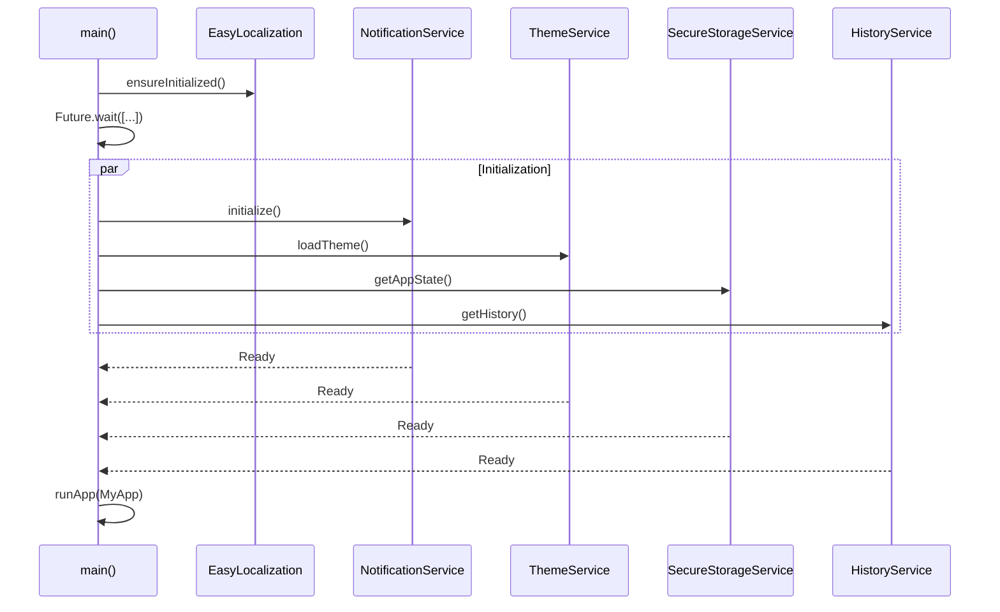
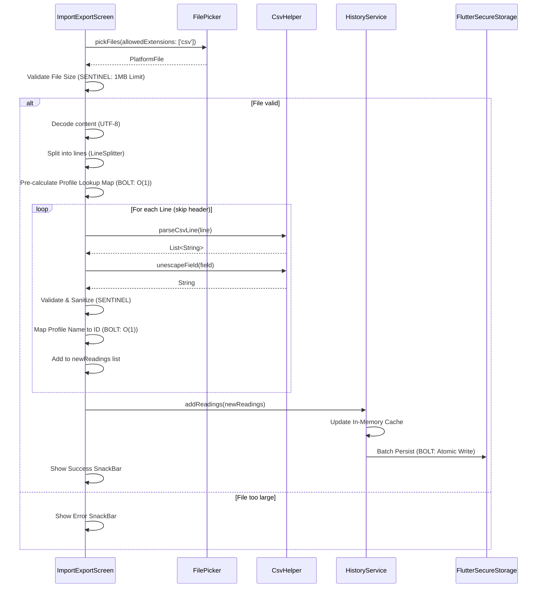

# 🏗️ EDA Readings - Architecture

This document provides a high-level overview of the architecture, folder structure, and development patterns used in the EDA Readings application.

## 📁 Folder Structure

The project follows a standard Flutter directory structure with a clear separation of concerns:

- **`lib/api/`**: Contains the `EDAClient` for interacting with the EDA API.
- **`lib/models/`**: Defines data structures (e.g., `ReadingResponse`, `UserProfile`) and their serialization logic.
- **`lib/services/`**: Houses singleton services for shared logic:
  - `HistoryService`: Manages local reading history with in-memory caching.
  - `SecureStorageService`: Handles persistent storage of credentials and app state.
  - `NotificationService`: Manages local reminders with timezone-aware scheduling and platform-specific permission handling.
  - `ThemeService`: Handles theme persistence and state, ensuring UI consistency across app sessions.
- **`lib/screens/`**: UI components categorized by screen. Includes dialogs and drawer components.
- **`lib/theme/`**: Centralized theme definitions (`AppTheme`).
- **`lib/utils/`**: Shared utility classes like `CsvHelper` for data transformation.
- **`assets/`**: Static resources like translations (JSON) and icons.
- **`bin/`**: Server-side or utility scripts (e.g., `proxy.dart` for Web development).
- **`test/`**: Comprehensive test suite for APIs, models, and services.

## 📖 Domain Glossary (EDA)

Understanding these terms is critical for working with the EDA API and the application's data models.

| Term | Full Name (Portuguese) | Description |
| :--- | :--- | :--- |
| **CIL** | Código de Identificação Local | Local Identification Code. A unique 10-digit number identifying a specific electricity delivery point. |
| **Contrato** | Número de Contrato | Electricity Contract Number. Associated with the CIL for authentication and billing. |
| **Ponta** | Horas de Ponta | Peak hours. High consumption period with higher costs. |
| **Cheias** | Horas de Cheias | Intermediate consumption period. |
| **Vazio** | Horas de Vazio | Off-peak hours. Lower consumption period (usually at night) with lower costs. |
| **Super Vazio** | Horas de Super Vazio | Deep off-peak. Even lower costs during specific night windows. |
| **Janela de Envio** | Data Aconselhável de Envio | Recommended Submission Window. The date provided by EDA when a reading should be submitted to ensure accurate billing and avoid estimates. |

### Meter Registers (Contadores)
The application handles up to three registers depending on the user's tariff:

1.  **`valorContador1` (Register 1)**: Primary reading. In a *Simples* tariff, this is the only counter. In *Bi-horária* or *Tri-horária*, it typically maps to the **Peak/Intermediate (Ponta/Cheias)** period.
2.  **`valorContador2` (Register 2)**: Used in *Bi-horária* and *Tri-horária* tariffs. Typically maps to the **Off-peak (Vazio)** period.
3.  **`valorContador3` (Register 3)**: Used exclusively in *Tri-horária* tariffs. Typically maps to the **Super Off-peak (Super Vazio)** period.

## 📖 API Reference

This section maps the localized (Portuguese) keys used by the EDA API to their technical roles and English descriptions within the application.

| API Key (JSON) | Technical Role | Description |
| :--- | :--- | :--- |
| `cil` | Identifier | Local Identification Code (10 digits). |
| `contrato` | Identifier | Electricity Contract Number associated with the CIL. |
| `cilToken` | Security | Session token required for submitting readings. |
| `cilTokenExpires` | Security | Expiration timestamp (ms) for the security token. |
| `data` | Metadata | Date of the most recent reading in the EDA system. |
| `dataAconselhavelEnvio` | Metadata | Recommended date for the next reading submission. |
| `valorContador1` | Reading | Value for Counter 1 in kWh (Peak/Intermediate). |
| `valorMinContador1` | Validation | Minimum allowed value for the next Counter 1 reading. |
| `valorMaxContador1` | Validation | Maximum allowed value for the next Counter 1 reading. |
| `register1` | Internal | Hardware register code for Counter 1 submission. |
| `tarifa` | Metadata | The active tariff name (e.g., Simples, Bi-horária). |

## 🏗️ State Management

This project deliberately avoids external state management libraries (like Provider, Riverpod, or Bloc) to keep the dependency tree lean and the architecture simple.

### Strategy
1.  **Shared State (Services)**: Global or shared state (history, credentials, theme) is managed by **Singleton Services**. These services maintain in-memory caches and handle persistence.
2.  **Local State (UI)**: Screen-specific or ephemeral state (form inputs, loading indicators, animation flags) is managed using standard `StatefulWidget` and `setState`.
3.  **Communication**: UI components call service methods directly to trigger updates. Some services (like `ThemeService`) extend `ChangeNotifier` to allow the UI to react to changes via listeners.

## 🔄 Data Flow

The following diagram illustrates how data flows from the API to the UI, highlighting the role of services and caching.



### Navigation Flow
The following diagram illustrates the primary user journey and the relationships between the application's screens.



### Reading Submission Flow
The following sequence diagram detail the interaction between components during a meter reading submission, including token validation and local persistence.



### Lifecycle & Initialization
The following sequence diagram illustrates the parallelized application bootstrap process in `main()`, ensuring all core services are ready before the UI is mounted.



### Stable Notification IDs
To prevent ID collisions and 32-bit integer overflow (particularly on Android), notification IDs are generated using the following strategy:
- **Source**: The profile's unique timestamp-based ID (`String`).
- **Transformation**: `int.parse(profileId) % 0x7FFFFFFF`.
- **Impact**: Ensures a stable, unique 31-bit integer that fits within standard platform limitations while remaining consistent for a given profile across app sessions.

## 🛠️ Core Services

The following table summarizes the primary responsibilities and storage strategies for the application's core singleton services.

| Service | Primary Responsibility | Storage / Persistence | Personas |
| :--- | :--- | :--- | :--- |
| **`HistoryService`** | Manages reading history and O(1) profile lookups. | `FlutterSecureStorage` (Encrypted JSON) | **BOLT**, **SENTINEL** |
| **`SecureStorageService`** | Manages credentials, profiles, and app state. | `FlutterSecureStorage` (Encrypted JSON) | **BOLT**, **SENTINEL** |
| **`NotificationService`** | Schedules local reading reminders. | Platform Native (Notification Center) | **PALETTE**, **SENTINEL** |
| **`ThemeService`** | Manages user theme preferences. | `SharedPreferences` (Plaintext) | **BOLT**, **PALETTE** |

### HistoryService
A singleton that manages the user's reading history. It implements a write-through cache:
1.  **Read**: Checks in-memory cache first, falls back to `FlutterSecureStorage` (encrypted). It also handles one-time migration from legacy `SharedPreferences` storage.
2.  **Write**: Updates in-memory list, updates profile-indexed map, and then asynchronously persists to `FlutterSecureStorage`.

### SecureStorageService
Manages sensitive user information (CIL/Contract) and the overall `AppStateData` (profiles, active profile). It uses `flutter_secure_storage` for encryption-at-rest.

### NotificationService
Provides local notification scheduling for reading reminders. It uses `timezone` for accurate delivery and handles platform-specific permission requests (e.g., Android 13+) to respect user privacy and system security requirements.

### ThemeService
A `ChangeNotifier` that manages the application's `ThemeMode`. It persists user preferences to `SharedPreferences` to ensure visual consistency across application restarts.

## 📤 Data Portability

The application allows users to import and export their reading history via CSV files. This logic is centralized in the `ImportExportScreen` and `SettingsScreen`, utilizing the `CsvHelper` utility.

### CSV Schema
To ensure data portability and consistency, all imports and exports follow a strict 5-column schema.

| Column | Name | Format / Constraint | Description |
| :--- | :--- | :--- | :--- |
| 1 | **Property** | String (Max 50) | The name of the property (Contract Profile). |
| 2 | **Date** | `yyyy-MM-dd HH:mm:ss` | The exact timestamp of the meter reading. |
| 3 | **Counter 1** | Numeric (Max 15) | Primary register value in kWh (Ponta/Cheias). |
| 4 | **Counter 2** | Numeric (Max 15) | Optional: Off-peak register value (Vazio). |
| 5 | **Counter 3** | Numeric (Max 15) | Optional: Super Off-peak register value (Super Vazio). |

### Security (SENTINEL)
- **Formula Injection Protection**: All exported fields starting with trigger characters (`=`, `+`, `-`, `@`, `\t`, `\r`, `\n`, `'`) are prepended with a single quote (`'`) to prevent execution in spreadsheet software.
- **Input Validation**: During import, the application enforces length limits (e.g., 50 for names, 15 for readings) and validates numeric formats before insertion into local storage.

### Performance (BOLT)
- **Lookup Optimization**: During import, a lookup map of property names to IDs is pre-calculated to achieve O(1) matching, replacing O(N) list scans.
- **Batch Processing**: Multiple readings are added to the `HistoryService` in a single atomic update to minimize secure storage I/O overhead.

### Import Flow
The following sequence diagram details the interaction between components during a CSV history import, highlighting the security and performance safeguards.



### Security & Performance in Portability
The data portability engine is a prime example of the interplay between **BOLT** and **SENTINEL** patterns:
- **Security-First Parsing**: The `CsvHelper` unescapes fields but the UI layer enforces strict length and type validation before any data enters the application state.
- **Atomic Persistence**: By batching imports in the `HistoryService`, we ensure that even large history files result in minimal disk I/O, maintaining UI responsiveness on mobile devices.

## 🎭 Persona Patterns

Development is guided by three core "Personas," each focusing on a specific dimension of software quality. You will find comments tagged with these personas throughout the codebase.

### ⚡ BOLT (Performance)
The **Bolt** pattern focuses on making the app fast and responsive.
- **Caching**: Aggressive in-memory caching in services (`HistoryService`, `SecureStorageService`) to avoid redundant I/O.
- **Parallelization**: Concurrently initializing independent services during startup (`main.dart`).
- **Pre-calculation**: Transforming data for charts and lists before the `build` method is called to keep the UI thread free (`DashboardScreen`).

### 🎨 PALETTE (UX & Accessibility)
The **Palette** pattern ensures the app is beautiful, accessible, and delightful to use.
- **Haptics**: Consistent use of `HapticFeedback` for tactile confirmation of user actions.
- **Semantics**: Enhanced `Semantics` labels for screen readers.
- **Visual Cues**: Clear destructive action confirmation and themed loading states.

### 🖋️ INK (Documentation)
The **Ink** pattern prioritizes codebase readability and developer experience.
- **Clear Intent**: Documentation that explains the "Why" behind complex logic.
- **Self-Documenting Code**: Professional tone and clear naming conventions.
- **Architecture Mapping**: Maintaining documents like this one to reduce onboarding friction.

### 🛡️ SENTINEL (Security)
The **Sentinel** pattern focuses on application security, data protection, and robust input validation.
- **Input Validation**: Strict enforcement of length limits and numeric format validation on all user-facing inputs.
- **Secure Storage**: Using `flutter_secure_storage` for credentials and ensuring sensitive data is never exposed in logs or UI.
- **Safe URI Construction**: Utilizing structured URI constructors (e.g., `Uri.https`, `Uri.replace(queryParameters: ...)`) to prevent injection vulnerabilities.
- **PR Standards**: Security-focused PRs must follow the format `🛡️ Sentinel: [CRITICAL/HIGH/MEDIUM] Fix [vulnerability type]` and include detailed sections for Severity, Vulnerability, Impact, Fix, and Verification.

## 🚀 Development Best Practices

### ⚡ Performance (BOLT)
- **Aggressive Caching**: Always check in-memory caches before performing disk I/O or platform channel calls.
- **Loop Optimization**: Hoist expensive object instantiations (like `DateFormat`) out of loops.
- **UI Responsiveness**: Pre-calculate derived data (like chart spots or formatted strings) during data loading rather than in the `build()` method.

### 🎨 UX & Accessibility (PALETTE)
- **Tactile Feedback**: Use `HapticFeedback.selectionClick()` or `lightImpact()` for interactive elements.
- **Rich Semantics**: Provide descriptive `Semantics` labels that concatenate multiple fields to provide full context for screen readers.
- **Consistent States**: Use themed empty states with icons and clear Calls to Action (CTAs).

### 🛡️ Security (SENTINEL)
- **Safe Parsing**: When parsing numeric input, always use `double.tryParse` and verify `number.isFinite` and `number >= 0`.
- **Length Limits**: Enforce `maxLength` on all `TextField` and `TextFormField` components (e.g., 50 for names, 15 for readings).
- **Safe URI Construction**: Always use structured URI constructors like `Uri.https()` or `Uri.replace(queryParameters: ...)` instead of manual string interpolation to mitigate injection risks.
- **Error Privacy**: Never expose raw exception messages in the UI; use localized, generic error messages.

## 🌐 Development Environment

### Web Development (CORS Proxy)
Due to browser security restrictions, direct requests to the EDA API will fail with CORS errors when running on the Web. A local proxy is provided to bypass this:

1.  **Start the proxy**:
    ```bash
    dart bin/proxy.dart
    ```
2.  **Run the app**:
    ```bash
    flutter run -d chrome
    ```

The `EDAClient` is pre-configured to detect the web environment and route requests through `http://localhost:8080`.

---
*Last Updated: 2026-05-16*
