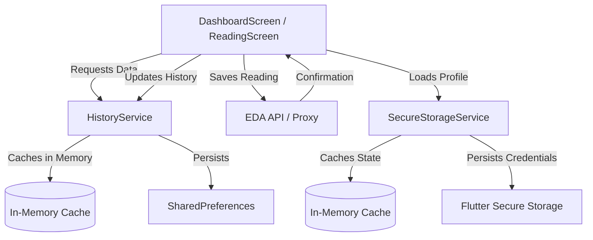

# 🏗️ EDA Readings - Architecture

This document provides a high-level overview of the architecture, folder structure, and development patterns used in the EDA Readings application.

## 📁 Folder Structure

The project follows a standard Flutter directory structure with a clear separation of concerns:

- **`lib/api/`**: Contains the `EDAClient` for interacting with the EDA API.
- **`lib/models/`**: Defines data structures (e.g., `ReadingResponse`, `UserProfile`) and their serialization logic.
- **`lib/services/`**: Houses singleton services for shared logic:
  - `HistoryService`: Manages local reading history with in-memory caching.
  - `SecureStorageService`: Handles persistent storage of credentials and app state.
  - `NotificationService`: Manages local reminders.
  - `ThemeService`: Handles theme persistence and state.
- **`lib/screens/`**: UI components categorized by screen. Includes dialogs and drawer components.
- **`lib/theme/`**: Centralized theme definitions (`AppTheme`).
- **`assets/`**: Static resources like translations (JSON) and icons.
- **`bin/`**: Server-side or utility scripts (e.g., `proxy.dart` for Web development).
- **`test/`**: Comprehensive test suite for APIs, models, and services.

## 🔄 Data Flow

The following diagram illustrates how data flows from the API to the UI, highlighting the role of services and caching.



## 🛠️ Core Services

### HistoryService
A singleton that manages the user's reading history. It implements a write-through cache:
1.  **Read**: Checks in-memory cache first, falls back to `SharedPreferences`.
2.  **Write**: Updates in-memory list, updates profile-indexed map, and then asynchronously persists to `SharedPreferences`.

### SecureStorageService
Manages sensitive user information (CIL/Contract) and the overall `AppStateData` (profiles, active profile). It uses `flutter_secure_storage` for encryption-at-rest.

## 🎭 Persona Patterns

Development is guided by three core "Personas," each focusing on a specific dimension of software quality. You will find comments tagged with these personas throughout the codebase.

### ⚡ BOLT (Performance)
The **Bolt** pattern focuses on making the app fast and responsive.
- **Caching**: Aggressive in-memory caching in services (`HistoryService`, `SecureStorageService`) to avoid redundant I/O.
- **Parallelization**: Concurrently initializing independent services during startup (`main.dart`).
- **Pre-calculation**: Transforming data for charts and lists before the `build` method is called to keep the UI thread free (`DashboardScreen`).

### 🎨 PALETTE (UX & Accessibility)
The **Palette** pattern ensures the app is beautiful, accessible, and delightful to use.
- **Haptics**: Consistent use of `HapticFeedback` for tactile confirmation of user actions.
- **Semantics**: Enhanced `Semantics` labels for screen readers.
- **Visual Cues**: Clear destructive action confirmation and themed loading states.

### 🖋️ INK (Documentation)
The **Ink** pattern prioritizes codebase readability and developer experience.
- **Clear Intent**: Documentation that explains the "Why" behind complex logic.
- **Self-Documenting Code**: Professional tone and clear naming conventions.
- **Architecture Mapping**: Maintaining documents like this one to reduce onboarding friction.

## 🌐 Development Environment

### Web Development (CORS Proxy)
Due to browser security restrictions, direct requests to the EDA API will fail with CORS errors when running on the Web. A local proxy is provided to bypass this:

1.  **Start the proxy**:
    ```bash
    dart bin/proxy.dart
    ```
2.  **Run the app**:
    ```bash
    flutter run -d chrome
    ```

The `EDAClient` is pre-configured to detect the web environment and route requests through `http://localhost:8080`.

---
*Last Updated: 2025-05-14*
